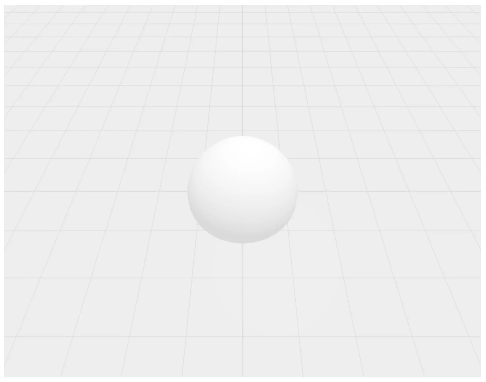

# 3D Scene Custom Objects

Plug a custom `THREE.Object3D` into `ui.scene` by pairing a JS component module
with an `Object3D` subclass.

## Contract

The Python side subclasses `Object3D` and declares the companion JS module via
the `component=` class kwarg. The path is resolved relative to the Python
source file:

```python
from typing_extensions import Self
from nicegui.elements.scene.scene_object3d import Object3D


class DynamicRoad(Object3D, component='dynamic_road.js'):
    def __init__(self, curves: list[dict], width: float, thickness: float) -> None:
        super().__init__(curves, width, thickness)

    def set_curves(self, curves: list[dict]) -> Self:
        self.run_method('set_curves', curves)
        return self

    def set_arrow_color(self, color: str) -> Self:
        self.run_method('set_arrow_color', color)
        return self
```

Arguments passed to `super().__init__(...)` are forwarded positionally to the
JS-side factory. Any additional Python method can dispatch to a JS-side method
of the same name via `self.run_method('<method_name>', *args)`.

The JS module's default export is a class. The framework instantiates it once
per scene object and calls one of two entry points to build the mesh:

- `create_geometry(...args)` — return a `THREE.BufferGeometry`. The framework
  wraps it in a `MeshPhongMaterial` (or a wireframe `LineSegments`) and feeds
  the built-in `material()` / `scale()` / `move()` controls automatically.
- `create_mesh(...args)` — return a `THREE.Object3D` outright. Use this when
  you need ongoing access to the mesh from your own methods (store it on
  `this.group`/`this.mesh`), or when the mesh is complex and cannot be
  represented with just a `THREE.BufferGeometry`.

Optional hooks the framework will call if you define them:

- `created()` — after the mesh is created by the scene
- `apply_material(color, opacity, side)` — override the default material
  handling. For composite objects, you can apply material selectively — in this
  example `apply_material` only affects the road mesh, leaving the direction
  line and arrow helpers untouched. You can use the `SimpleMaterialLoader` class
  found in `SceneLib` to apply the material to your meshes.

An empty object would look like this (omit methods you don't want to implement):

```js
import SceneLib from "nicegui-scene";
const { THREE } = SceneLib;

export default class CustomObject {
    // Either
    create_geometry(...args) {} // return a THREE.BufferGeometry
    // Or:
    create_mesh(...args) {} // return a THREE.Mesh

    created() {}

    apply_material(color, opacity, side) {}
}
```

Run the example with: `uv run main.py`.


