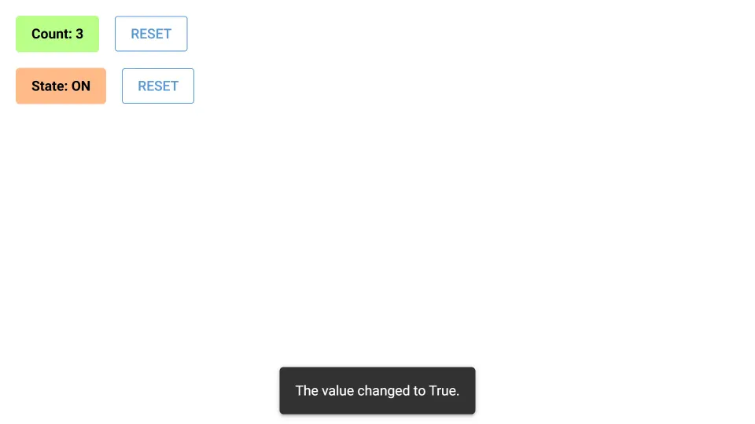

# Custom Vue Component

Write and integrate a custom Vue component.

One component is implemented using JavaScript, the other using Vue's Single-File Component (SFC) syntax.

## Counter Component (counter.js)

The `Counter` component is a simple counter that increments a value.
On change, it emits an event with the new value.
A reset method allows to reset the counter to 0.

The JavaScript code in `counter.js` defines the front-end logic of the component using JavaScript.

## OnOff Component (on_off.vue)

The `OnOff` component is a simple toggle that switches between on and off.
On change, it emits an event with the new value.
A reset method is also provided to reset the toggle to off.

The Single-File Component in `on_off.vue` defines the front-end logic of the component using Vue 2.
In contrast to the JavaScript code in `counter.js`, it splits the template, script, and style into separate sections.
