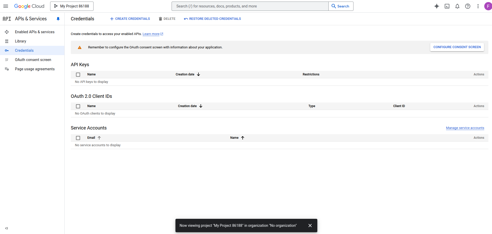
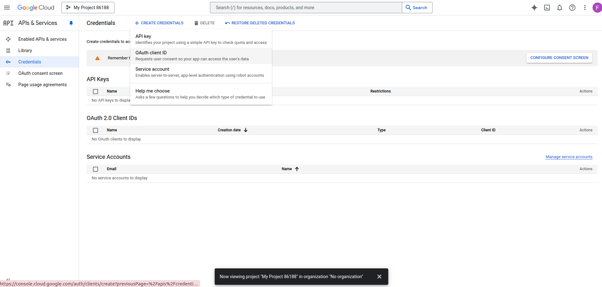

First, you will need to get your Google credentials from the (Google cloud console)[https://console.cloud.google.com/].
You will see a screen similar to the one below. Click on the "Create Project" button to create a new project.

It will prompt you to create a project - do so, initializing the project name and location and any other fields as required.
Then, once you create your project, you will be redirected to a screen that looks similar to this:

From there, you want to click the 'Create Credentials' button, and click on OAuth client ID, as shown in the image:

From there, you set the Application type to be 'Web application', and set the Authorized redirect URIs to be `http://localhost:8000/auth`. Then click 'Create'.

Note: This means that when you have the `ui.run`, it must run on port 8000, on localhost. Running on `127.1....` won't work.

Afterwards, you should see it in the Credentials tab, you can save the Client ID and Client Secret, and use them in the .env file in the environment variables `GOOGLE_CLIENT_ID` and `GOOGLE_CLIENT_SECRET` respectively.

From there, you can run the main.py
