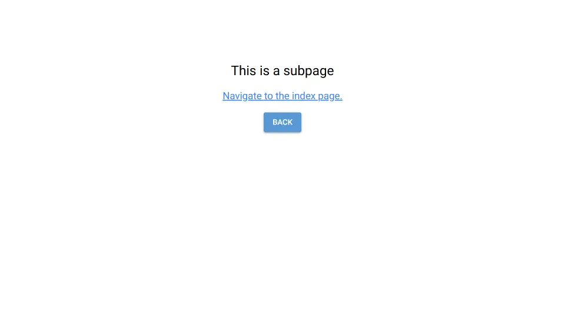

# NGINX Subpath

Serve NiceGUI on a subpath behind a reverse proxy.



Here we use Nginx.
For a Traeffic example have a look at https://github.com/zauberzeug/nicegui/blob/main/docker-compose.yml.

## Try Out

Just run

```bash
docker compose up
```

Then you can access http://localhost/nicegui.
