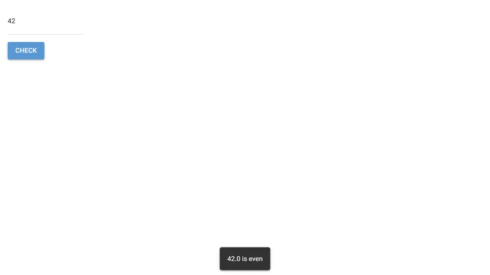

# Node Module Integration

Use multiple third-party NPM modules as dependencies in a NiceGUI app.



The app uses the [is-odd](https://www.npmjs.com/package/is-odd) node modules to check if a number is even or odd.
We chose this package to demonstrate a very simple node module which has a dependency itself,
namely the [is-number](https://www.npmjs.com/package/is-number) package.
Using NPM, we can easily install both packages and bundle them into a single file which can be used in the app.
The package.json file defines the is-odd dependency and some dev dependencies for bundling the node module,
the rollup.config.mjs file configures the bundling process,
the src/index.mjs file is the entry point for the node module,
and number_checker.js as well as number_checker.py define a new UI element to be used in the NiceGUI app main.py.

1. First, install all third-party node modules (assuming you have NPM installed):

   ```bash
   npm install
   ```

   This will create a node_modules directory containing the is-odd and is-number modules as well as some dev dependencies.

2. Now bundle the node module:

   ```bash
   npm run build
   ```

   This will create a dist directory containing the is-odd module.

3. Finally, you can run the app as usual:

   ```bash
   python3 main.py
   ```
