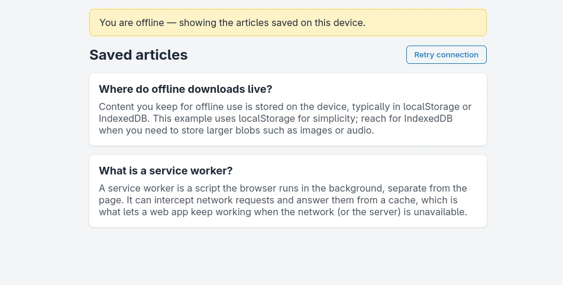

# Offline Access

Keep a NiceGUI app usable without a network connection by combining a service worker with client-side storage, the way YouTube still shows your downloads when you are offline.



## How it works

NiceGUI is server-driven: the browser loads an HTML shell and then a WebSocket connection lets the *server* build and update the UI.
When the device is offline that connection cannot be established, so NiceGUI's live rendering is unavailable.
This example works around that with two browser features:

- A **service worker** (`service_worker.js`) runs in the background and intercepts requests.
  While online it just forwards them to the network, so the live app behaves normally.
  It pre-caches a self-contained `/offline` page and, when a navigation fails because the server is unreachable, serves that page instead.
- **Client-side storage** (`localStorage`) holds the content the user chose to keep.
  "Save for offline" writes an article into `localStorage` via `ui.run_javascript`, and the offline page reads it back with plain JavaScript — no server involved.

A minimal web app manifest (`manifest.webmanifest`) is also linked so the app can be installed like a native one.

## Try it

1. Run the app and open it **online** first, so the service worker can install and cache the offline page:

   ```bash
   python3 main.py
   ```

2. Save one or more articles for offline reading.
3. Simulate being offline: stop the server (`Ctrl+C`), or switch the browser dev tools **Network** tab to *Offline*.
4. Reload the page. The service worker serves the cached offline page, which lists the articles you saved.

> **Note:** Service workers require a secure context, so they only run on `http://localhost` or over HTTPS.
