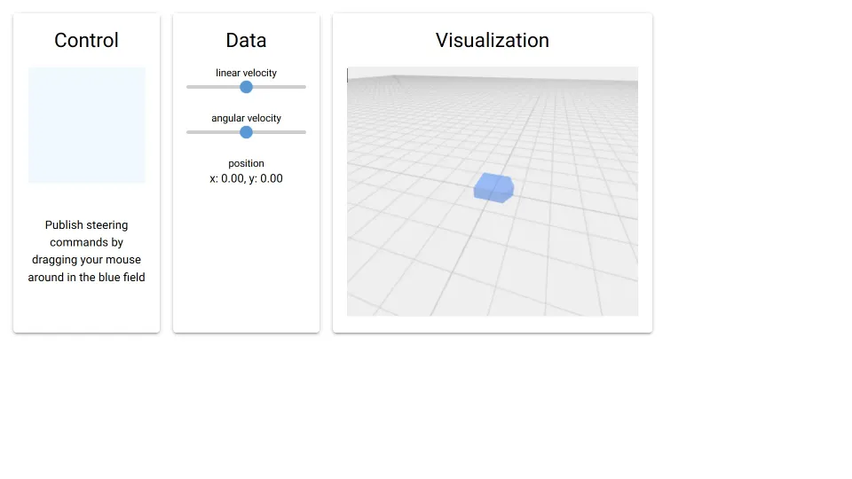

# ROS2
Using NiceGUI as web interface for a ROS2 robot



This example is a basic ROS2 implementation with NiceGUI.
It starts up a user interface with virtual joystick and pose visualization reachable through http://127.0.0.1:8080.
The joystick publishes twist messages which are consumed by a simple simulator node which itself publishes the new pose of a virtual mobile robot.
ROS2 and NiceGUI are fully functional in this example.

Over all it is a bit more complex than a super minimal example to allow auto-reloading of the NiceGUI ROS2 node.


## Usage

Change into the `examples/ros2` folder and run:

```bash
docker compose up --build
```

Afterwards you can access the user interface at http://127.0.0.1:8080.

If you want to run the NiceGUI node locally or in your own ROS2 project, you can simply copy the code from the `ros2_ws/src/gui` folder.
