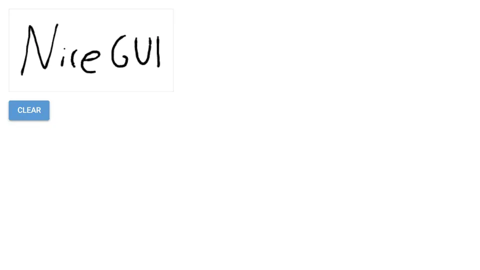

# Signature Pad

Build a custom element based on the third-party NPM module [signature_pad](https://www.npmjs.com/package/signature_pad).



The app uses the [signature_pad](https://www.npmjs.com/package/signature_pad) node module to create a signature pad.
In package.json, the signature_pad module is listed as a dependency,
while signature_pad.js and signature_pad.py define the new UI element which can be used in main.py.

Furthermore, rollup is used to bundle and minify the signature_pad module and places the result in the dist directory.
The rollup configuration is in rollup.config.mjs.
The entry point is defined in src/index.mjs, basically just re-exporting the signature_pad module.

1. First, install the third-party node modules (assuming you have NPM installed):

   ```bash
   npm install
   ```

   This will create a node_modules directory containing the signature_pad module.

2. Build the signature_pad module:

   ```bash
   npm run build
   ```

   This will create a dist directory containing the signature_pad module.

3. Now you can run the app as usual:

   ```bash
   python3 main.py
   ```
