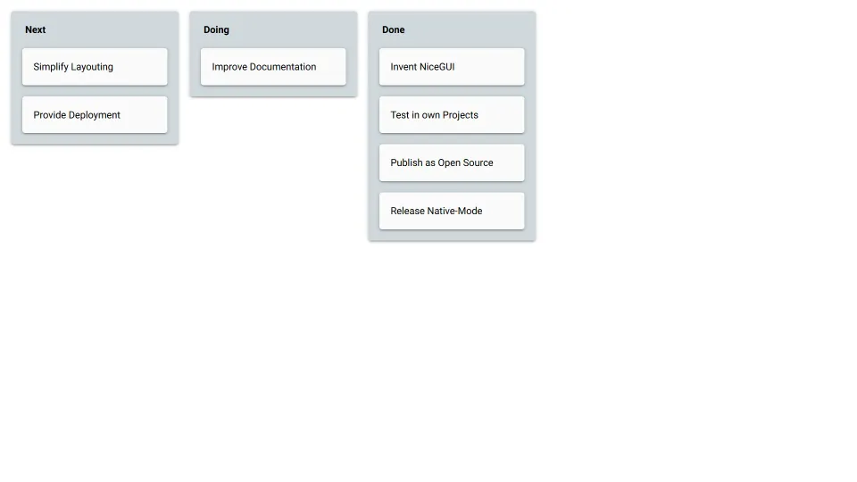

# Trello Cards

Show Trello-like cards that can be dragged and dropped into columns.

Note: NiceGUI provides a built-in `make_sortable()` method for drag-and-drop sorting.
This example predates that API and shows how to build a custom drag-and-drop solution from scratch
using HTML5 drag events, which gives you full control over acceptance logic and visual feedback.

