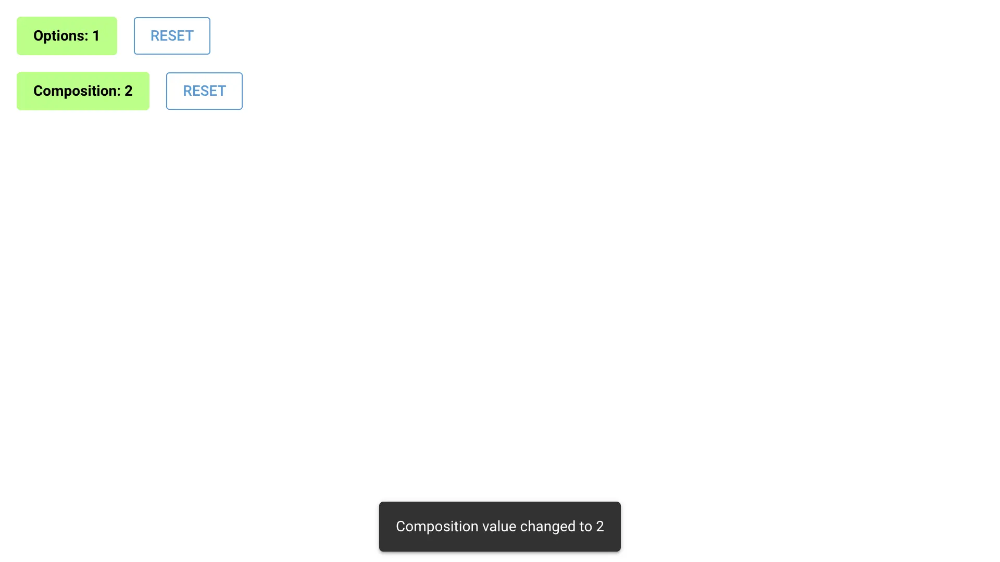

# Custom SFC Vue Component using Vite

Build Single-File Component (SFC) Vue components with Vite in NiceGUI.



Using Vite rather than NiceGUI's vbuild based build step currently supports more features of the SFC spec.
It might be useful to see also:

1. `custom_vue_component`: an example of a custom Vue component without a build step
2. `signature_pad`: an example with a Rollup-based build step and Javascript dependency

There are two implementations of a counter component.
`CounterOptions` is implemented using the options API, and `CounterComposition` uses the composition API.
Both use TypeScript and Vue's Single-File Component (SFC) syntax.

## Quick Start

The example includes pre-built components, so you can run it immediately:

```bash
python main.py
```

## Development Setup

To modify and rebuild the Vue components, install the NPM dependencies:

```bash
npm install
```

Then run Vite's watch process in one terminal:

```bash
npm run watch
```

And the NiceGUI server in another terminal:

```bash
python main.py
```

This will automatically rebuild your Vue components whenever you save changes.

Alternatively, you can rebuild components manually after making changes:

```bash
npm run build
```
