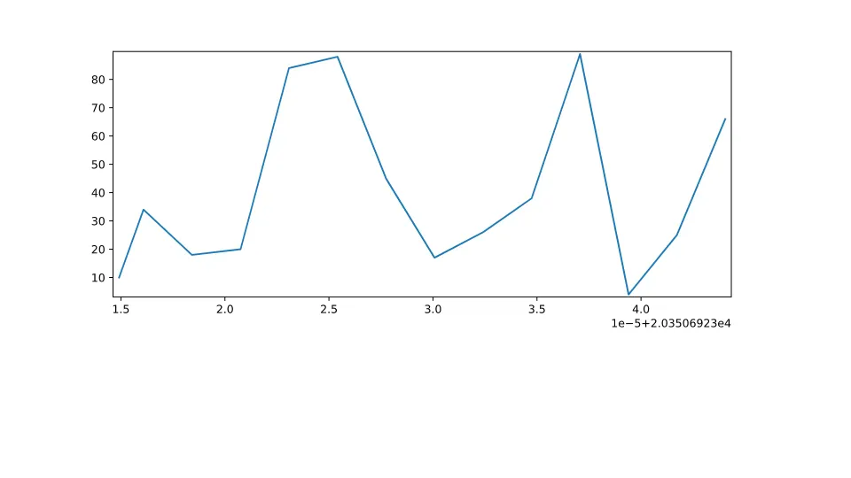
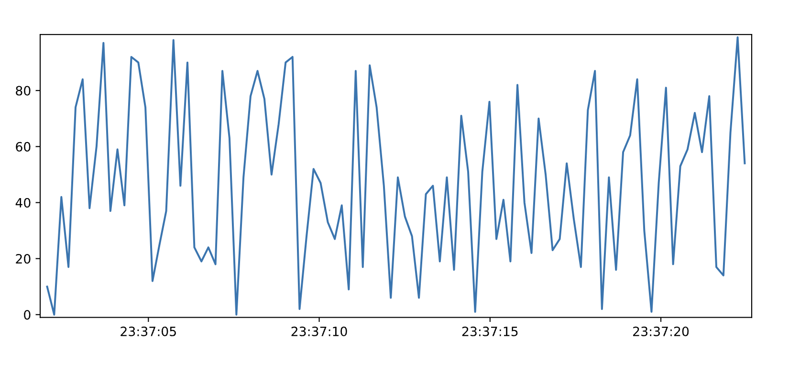

# ZeroMQ

Build a simple ZeroMQ PUSH/PULL server and client.



This example is a basic Zeromq implementation with NiceGUI.
It shows how to stream data from a ZeroMQ socket to a NiceGUI plot.

In order to do this, the zmq Python library is used to create a publisher and a subscriber.
The main interesting aspect is that the zmq.async library is used to create a subscriber that can be used in an asyncio loop, which is necessary to run the NiceGUI server.

## Running the example

There are two components to this example: the publisher and the NiceGUI server.

In addition to the normal NiceGUI dependencies, the zmq library must be installed (see requirements.txt).

### Running the publisher

The publisher is a simple Python script that sends random data to a ZeroMQ socket.
To run the publisher in the background, simply execute the following command:

```bash
python zmq-server.py &
```

### Running the NiceGUI server

The NiceGUI server is a Python script that creates a plot and updates it with data from the ZeroMQ socket.
To run it, execute the following command:

```bash
python main.py
```

### Results

Once both the publisher and GUI server are running, you will see an updating plot on the UI.



To kill zmq-server.py running in the background, execute the following command after main.py ends.

```bash
kill -9 %%
```
